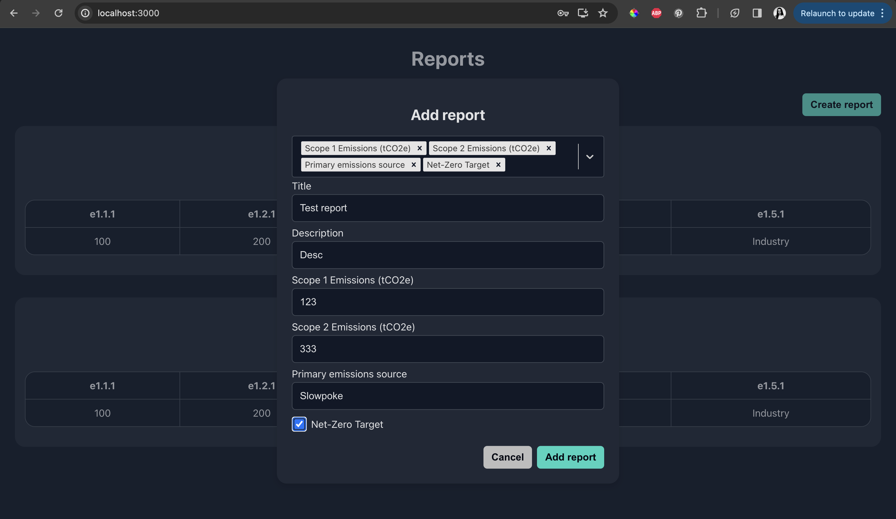

# Full stack app

## Running locally

### Prerequisites:

- Docker is installed and running

### How to start backend

1. Navigate to `server` folder
2. Install dependencies: `npm i`
3. Create `.env` file by copying contents of `.env.example`
4. Start database server in docker: `docker compose up` 
5. Populate database:
   - Apply DB migrations: `npm run db:migrate:dev`
   - Seed database: `npm run db:seed`
6. Start backend: `npm run start:dev`

### How to start frontend

1. Navigate to `client` folder
2. Install dependencies: `npm i`
3. Start frontend: `npm start`

### Logging in

Once application is started and DB seed is performed, the following creds can be used for logging in:
`test@test.com / SamplePass`

### Running frontend tests

Sample frontend tests are implemented using Cypress.

Component tests could be run using command `npm test`.

### Running backend tests

Sample backend tests are implemented using `jest`.

Command to run: `npm test`.

### Main screens

Login form:

Report creation:

Report create form validation:

List of reports:

